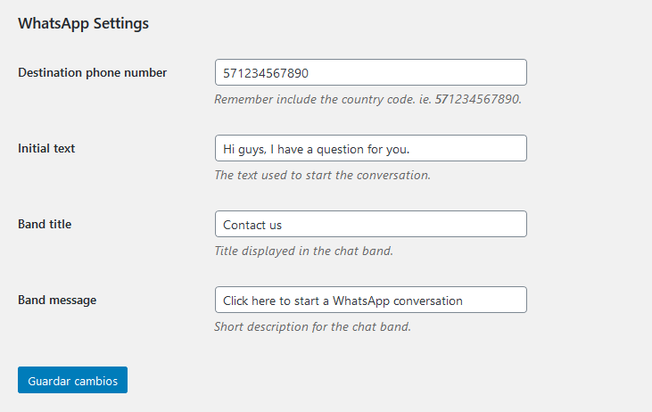

# WhatsApp Link

- Contributors: vizapata
- Tags: whatsapp, chat, contact, messages
- Requires at least: 3.0.1
- Tested up to: 5.4
- Stable tag: 4.3
- License: GNU General Public License v3.0
- License URI: http://www.gnu.org/licenses/gpl-3.0.html

A simple plugin to display a WhatsApp link at the bottom of all public pages of a WordPress Website.

## Description

When this plugin is enabled, automatically a link will appear at the bottom of the viewport in all public-faced pages. 

The settings are pretty simple. This plugin just need the WhatsApp number destination and a couple ot texts used in the interface.

## Installation

This section describes how to install the plugin and get it working.

1. Upload `whatsapp-link.php` to the `/wp-content/plugins/` directory
2. Activate the plugin through the 'Plugins' menu in WordPress
3. Go to the menu `Settings` => `WhatsApp Settings` and set your own configuration.
4. The Website will display a minimized chat-style link at the rigth bottom of all public pages (Desktop). Or fixed at bottom for mobile devices.

## Frequently Asked Questions

### How about data protection

This plugin just save the WhatsApp number phone in Wordpress Settings. But, when you use this plugin, that number will be visible in all pages. So take care of using a business number phone not your personal one.

### Can I use a different style

The style has no another styling settings. The initial intention is keep it as much simple as posible. If you want to add custom style, feel free to override the default style.

## Screenshots

## Thanks

The structure for this plugin was made using the [WPBP Generator](https://github.com/WPBP/generator)

## Changelog

### 1.0.0
* Initial plugin import

